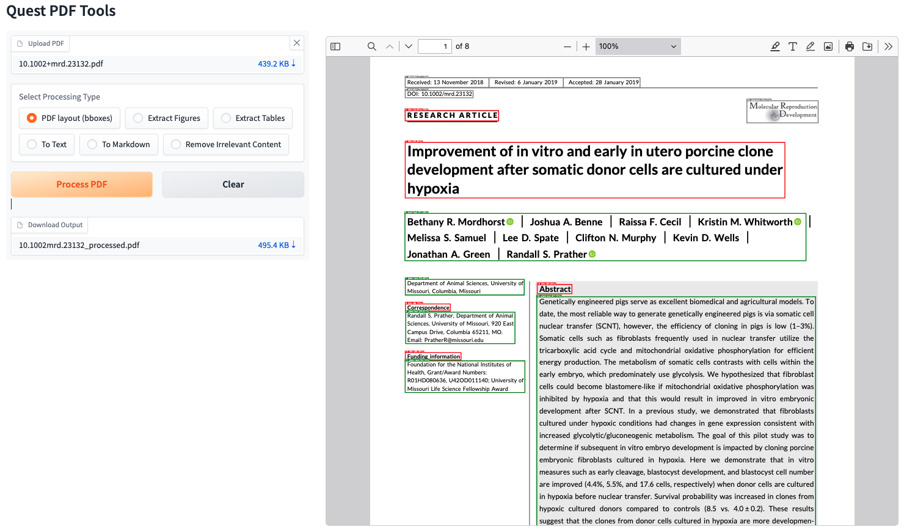

[](https://www.gnu.org/licenses/agpl-3.0) [](https://github.com/quest-bih/quest-pdf-tools/stargazers) [](https://github.com/quest-bih/quest-pdf-tools/issues) [](https://github.com/quest-bih/quest-pdf-tools/issues?q=is%3Aissue+is%3Aclosed)

A FastAPI-based web application and API service for processing PDF documents, providing comprehensive document analysis and content extraction capabilities. The service can be deployed either as a full web application with an intuitive interface or as a standalone API.

## Features

- **PDF Layout Analysis**: Detects and annotates different document elements including titles, text blocks, figures, tables, and formulas
- **Irrelevant Content Removal**: Automatically identifies and removes headers, footers, and other irrelevant content from PDFs
- **Figure Extraction**: Extracts and exports figures from PDFs into separate image files
- **Table Extraction**: Identifies and exports tables from PDFs into separate files
- **Text Extraction**: Extracts plain text content from PDFs with preserved formatting
- **Markdown Conversion**: Converts PDF content into markdown format for easy integration with documentation systems
- **REST API Interface**: Simple HTTP endpoints for processing PDFs
- **YOLO-based Detection**: Utilizes [DocLayout-YOLO](https://github.com/opendatalab/DocLayout-YOLO) model for accurate document layout analysis

## 🚧 Work in Progress

This is an ongoing project, and some features are still under active development. The current implementation:

- Works exclusively with scientific PDF documents
- Uses layout analysis optimized for academic papers
- Will improve over time through:
  - Manual refinements of the algorithms
  - Integration of more capable machine learning models

## ⚠️ Known Limitations

- The layout ordering algorithm is specifically designed for scientific papers and may not work correctly with other types of PDFs
- Markdown conversion for tables is still under development and may produce malformed output in some cases
- The accuracy of element detection and classification will improve as the models are refined
- The backend may take a few seconds to fully deploy and become responsive to requests

## Installation and Usage

You can use Quest PDF Tools either directly on your system or via Docker.

### Direct Installation

1. Clone the repository:
```bash
git clone https://github.com/quest-bih/quest-pdf-tools.git
cd quest-pdf-tools
```

2. Install dependencies:
```bash
pip install -r requirements.txt
```

3. Configure environment variables:
Create a .env file in the root directory with the following content
```bash
GRADIO_PORT = XXXX # Gradio web interface port defaults to 7860
FAST_API_PORT = XXXX # FastAPI backend port defaults to 8000
DEPLOY_MODE = "full" # Deploy mode can be "full" or "backend" : "full" for an additional deployement of frontend, "backend" for backend only
FAST_API_WORKERS = X # Number of FastAPI workers defaults to 1
```

## Usage

Start the application in one of two modes:

1. Full mode (includes frontend and backend):
```bash
python src/run.py --mode full
```
The frontend will be available at  `127.0.0.1:<GRADIO_PORT>` while the backend will be available at `127.0.0.1:<FAST_API_PORT>`

2. Backend mode (only backend):
```bash
python src/run.py --mode backend
```
The backend will be available at `127.0.0.1:<FAST_API_PORT>`

## Docker Installation & Usage

1. Build the Docker image:
```bash
docker build -t quest-pdf-tools .
```

2. Run the container:
```bash
docker run -p <GRADIO_PORT>:<GRADIO_PORT> -p <FAST_API_PORT>:<FAST_API_PORT> quest-pdf-tools
```

Depending on your deploy mode configuration, the frontend will be available at `127.0.0.1:<GRADIO_PORT>` while the backend will be available at `127.0.0.1:<FAST_API_PORT>`

## API Endpoints

### 1. Process PDF Layout

**Endpoint**: `POST /process-pdf/`

Analyzes the PDF layout and returns an annotated version with detected elements highlighted in different colors:
- Title (Red)
- Plain Text (Green)
- Figures (Blue)
- Figure Captions (Orange)
- Tables (Purple)
- Table Captions (Teal)
- Table Footnotes (Magenta)
- Formulas (Brown)
- Formula Captions (Cyan)

```bash
curl -X POST "http://localhost:8000/process-pdf/" \
     -H "accept: application/json" \
     -H "Content-Type: multipart/form-data" \
     -F "file=@your_document.pdf"
```

### 2. Remove Irrelevant Content

**Endpoint**: `POST /remove-irrelevant/`

Identifies and removes irrelevant content (headers, footers, etc.) from the PDF.

```bash
curl -X POST "http://localhost:8000/remove-irrelevant/" \
     -H "accept: application/json" \
     -H "Content-Type: multipart/form-data" \
     -F "file=@your_document.pdf"
```

### 3. Extract Figures

Endpoint : `POST /extract-figures/`

Extracts all figures from the PDF and returns them as a ZIP file.

```bash
curl -X POST "http://localhost:8000/extract-figures/" \
     -H "accept: application/json" \
     -H "Content-Type: multipart/form-data" \
     -F "file=@your_document.pdf"
```

### 4. Extract Tables

**Endpoint** : `POST /extract-tables/`

Extracts all tables from the PDF and returns them as a ZIP file.

```bash
curl -X POST "http://localhost:8000/extract-tables/" \
     -H "accept: application/json" \
     -H "Content-Type: multipart/form-data" \
     -F "file=@your_document.pdf"
```

### 5. Extract Text

**Endpoint** : `POST /extract-text/`

Extracts all text content from the PDF and returns it as JSON.

```bash
curl -X POST "http://localhost:8000/extract-text/" \
     -H "accept: application/json" \
     -H "Content-Type: multipart/form-data" \
     -F "file=@your_document.pdf"
```

### 6. Extract Markdown

**Endpoint** : `POST /extract-markdown/`

Converts the PDF content to markdown format and returns it as JSON.

```bash
curl -X POST "http://localhost:8000/extract-markdown/" \
     -H "accept: application/json" \
     -H "Content-Type: multipart/form-data" \
     -F "file=@your_document.pdf"
```

## Examples

### Frontend Interface

The web interface provides an intuitive way to interact with the PDF processing tools. The interface features a clean, user-friendly design with drag-and-drop file upload capabilities and clear processing options.


### Example Processing Results

Below are examples demonstrating the various processing capabilities of Quest PDF Tools using a sample scientific paper.

| Processing Type | Description | Example Output |
|----------------|-------------|----------------|
| Original Document | Example scientific paper used for demonstration | [Example PDF document](examples/10.1002mrd.23132/10.1002mrd.23132.pdf) |
| Layout Analysis | Document elements highlighted with different colors | [Processed PDF Layout](examples/10.1002mrd.23132/10.1002mrd.23132_processed.pdf) |
| Cleaned Document | Headers, footers, and irrelevant content removed | [Cleaned PDF](examples/10.1002mrd.23132/10.1002mrd.23132_cleaned.pdf) |
| Figure Extraction | Automatically identified and extracted figures | [Extracted Figures](examples/10.1002mrd.23132/figures/) |
| Figure Package | Downloadable ZIP file containing all figures | [Zipped Figures](examples/10.1002mrd.23132/figures/10.1002mrd.23132_figures.zip) |
| Table Extraction | Identified tables with maintained structure | [Extracted Tables](examples/10.1002mrd.23132/tables/) |
| Table Package | Consolidated ZIP file of all tables | [Zipped Tables](examples/10.1002mrd.23132/tables/10.1002mrd.23132_tables.zip) |
| Text Content | Extracted plain text with preserved formatting | [Extracted Text](examples/10.1002mrd.23132/10.1002mrd.23132.txt) |
| Markdown Output | PDF content converted to markdown format | [Extracted Markdown](examples/10.1002mrd.23132/10.1002mrd.23132.md) |
| Supporting Images | Organized folder for markdown conversion images | [Supporting Markdown](examples/10.1002mrd.23132/md_images/) |


## TODO 

- [ ] Revamp markdown content generation system
- [ ] Enhance document layout sequencing logic
- [ ] Upgrade text processing capabilities
  - [ ] Incorporate efficient OCR model
  - [ ] Optimize text content extraction
- [ ] Enable batch PDF document processing
- [x] Create intuitive Gradio web interface
- [ ] Improve the frontend interface
  - [ ] Add support for multiple PDF uploads
  - [ ] Improve user feedback and error handling


## Dependencies

- [FastAPI](https://github.com/fastapi/fastapi) - Modern, fast web framework for building APIs with Python
- [PyMuPDF](https://github.com/pymupdf/PyMuPDF) - Python bindings for the MuPDF PDF library
- [DocLayout-YOLO](https://github.com/opendatalab/DocLayout-YOLO) - YOLO-based document layout analysis model
- [PyTorch](https://pytorch.org/) - Open source machine learning framework
- [Uvicorn](https://www.uvicorn.org/) - Lightning-fast ASGI server implementation
- [Gradio](https://gradio.app/) - Create UIs for machine learning models and data science workflows
- Other dependencies listed in `requirements.txt`

## Project Structure

```plaintext
quest-pdf-tools/
├── src/                  # Source code directory
│   ├── api.py            # FastAPI endpoints and API configuration
│   ├── app.py            # Gradio web interface implementation
│   ├── doc_layout.py     # Document layout analysis implementation
│   ├── pdf_processor.py  # Core PDF processing functionality
│   ├── utils.py          # Utility functions and helper methods
│   └── run.py            # Main application entry point
├── examples/             # Example files and processing results
│   └── ...               # Sample scientific paper with processing outputs
├── models/               # Pre-trained model files
│   └── ...
├── pdfs/                 # Directory for temporary PDF storage
│   └── ...
├── wiki/                 # Project documentation and wiki
├── requirements.txt      # Python package dependencies
├── .env                  # Environment configuration
├── .gitignore            # Git ignore rules
├── .dockerignore         # Docker ignore rules
├── CODE_OF_CONDUCT.md    # Project code of conduct
├── LICENSE               # Project license terms
├── logo.png              # Project logo
└── Dockerfile            # Container configuration
```

## Contributing

We welcome contributions to Quest PDF Tools! Here's how you can help:

### Opening Issues
- Report bugs by creating an issue with a clear description and steps to reproduce
- Suggest new features or improvements
- Ask questions about the project

### Pull Requests
1. Fork the repository
2. Create a new branch (`git checkout -b feature/improvement`)
3. Make your changes
4. Commit your changes (`git commit -am 'Add new feature'`)
5. Push to the branch (`git push origin feature/improvement`)
6. Create a Pull Request

Please ensure your PR:
- Clearly describes the changes and their purpose
- Includes any necessary documentation updates
- Follows the existing code style


## License

This project is licensed under the terms of the [LICENSE](LICENSE) file included in the repository.